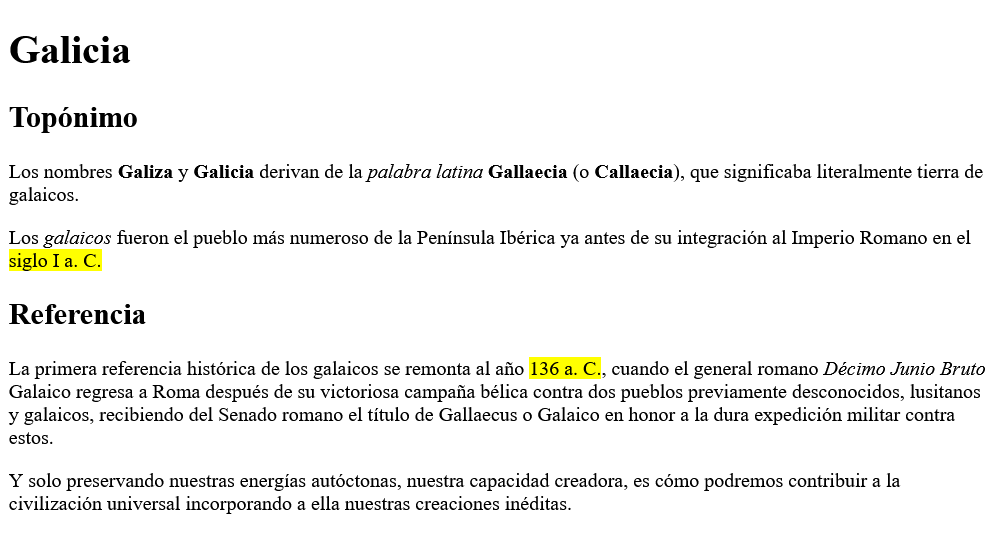

# Sesión 1 HTML

 MF 0491_3
 UF 1841 
 5 de 60 Horas

- Darse de alta en classroom

## ¿Qué es HTML?

[Guías Bluuweb, HTML Fundamentos](https://bluuweb.dev/01-html/)

El __<abbr title="Lenguaje de Marcado de Hipertexto">HTML</abbr>__ es el código que se utiliza para __estructurar__ y desplegar una __página web__ y sus contenidos.

<dl>
    <dt>
        HTML
    </dt>
    <dd>
    <abbr title="Hipertext Markup Language">HTML</abbr> cómo indica su acrónimo es un "lenguaje de marcas" (ML) para <em>estructurar</em> (las propias etiquetas son semánticas) el contenido en dichas marcas (en adelante <strong>tags</strong>) 
    </dd>
</dl>

En resumen __HTML__:
- Utiliza tags
- Por la característica anterior se le llama __markup language__
- Estructura contenido

## Pregunta

¿Quién inventó el HTML? ¿Qué otras contribuciones hizo para el desarrollo web?

## Hola mundo

- Elaborar toda la clase en un block de notas el siguiente ejemplo

```html
<!DOCTYPE html>
<html lang="es">
    <head>
        <meta charset="utf-8" />
        <title>Mi página de prueba</title>
    </head>
    <body>
        <p>Hola mundo HTML!</p>
    </body>
</html>
```

## Ejercicio de refuerzo

A partir de la siguiente captura elaborar el documento HTML correcto



- [Enlace al texto](./text.txt)
- [Enlace de etiquetas](https://allthetags.com/)
- Puedes utilizar la herramienta [www.w3chools.com](https://www.w3schools.com/html/tryit.asp?filename=tryhtml_default)